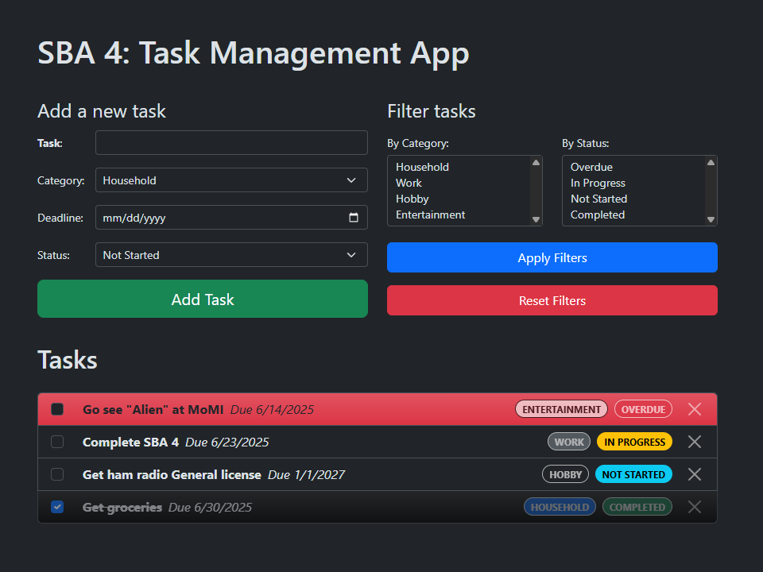

# SBA 4: Task Management App

[Karl Johnson](https://github.com/hirekarl)  
2025-RTT-30  
<date datetime="2025-06-20">2025-06-20</date>  

## Submission Summary
I applied our learnings related to utility classes in Bootstrap to design a user interface with all default components.

### Features
- To add a task, fill out the "Add a new task" form and click "Add Task."
- Added tasks appear below the forms as Bootstrap `list-group-item`s, sorted first by status (Overdue, In Progress, Not Started, Completed), then by deadline, then by category (Household, Work, Hobby, Entertainment), and finally by alphabetical sequence.
- The task list updates dynamically when tasks are added or removed, when filters are applied or reset, and when task statuses change.
- To mark a task as Completed, click the task's checkbox. To undo, click the checkbox again.
- Tasks are marked as Overdue if the task's deadline has passed and if not marked as Completed.
- Users can toggle between Not Started and In Progress by clicking the status badge on the right-hand side of each task.
- Tasks can be deleted by clicking the "X" button on the far right side of each task.
- Users can filter tasks by interacting with the `<select multiple>` inputs in the "Filter tasks" form and clicking the "Apply Filters" button&mdash;the task list will update to display only tasks matching given statuses and categories. Clicking "Reset Filters" will clear the `<select>` inputs and display the full task list.
- Tasks are saved to `localStorage` in an object called `tasks`. The `localStorage` object updates on every state change.

### Viewer Instructions
Go to [incredible-mousse-c22548.netlify.app](https://incredible-mousse-c22548.netlify.app/); view solution source below.

### Solution Source
Solution source code can be found at the links below:
- **HTML**: [`index.html`](./index.html)
- **JavaScript**: [`app.js`](./app.js)
- **CSS**: [`style.css`](./style.css)

### Reflection
Write a short reflection (100-200 words) included within the repository discussing:
- Challenges faced during the project.
- How you approached solving those challenges.
- What you would improve if given more time.

> It was very laborious to implement the code necessary to render each task list `<li>` and its children with Bootstrap. I had to draw a diagram on paper to understand each of these elements, then it was trial and error to get them to match the mock-ups I made in plain HTML. In retrospect, I could've assigned a block with `.innerHTML`, but something about passing a big block of raw, unescaped HTML feels off to me!
> 
> The hardest part was wrangling JavaScript `Date()` objects, which behave differently than `datetime`s in Python. I ultimately decided it was easier to store and deal with all the dates in `YYYY-MM-DD` format, which took a bunch of research and trial and error to get right in and of itself.
>
> I've never parsed data from HTML forms with JavaScript before. It might have been easier to add `"click"` event listeners to each button, but I wanted to practice implementing `"submit"` and `"reset"` events.
>
> I was able to fix almost all the accessibility issues flagged by Lighthouse. The one that remains in my report is a flag related to background-versus-foreground contrast related to the Completed badge. With more time, I'd want to play around with custom colors and typography and layout design (maybe put the two forms on the side and have the task list on the right?). I'd also like to refine the sorting functionality and let users choose how to sort.
>
> Also, JavaScript form validation that displays error messages when required form fields are not filled.

## Assignment
### Overview
In this assessment, you will build a Task Management App that allows users to add tasks with deadlines, assign categories, and update the status of each task. This app will require you to apply a wide range of JavaScript concepts, including arrays, objects, DOM manipulation, conditionals, and local storage to persist the task data.

### Objective
You will create a dynamic task management app that lets users:
1. Add new tasks with details such as the task name, category, deadline, and status.
2. Update the status of tasks to reflect their progress (e.g., “In Progress,” “Completed,” “Overdue”).
3. Automatically update task status based on the current date (tasks past their deadline will be marked as “Overdue”).
4. Filter tasks by status or category.
5. Persist task data using local storage so tasks are saved even after refreshing the page.

### Project Requirements
#### 1. Adding New Tasks
- Create input fields for the task name, category, deadline, and an initial status (e.g., “In Progress”).
- Include an “Add Task” button that will add the task to the task list.
- Each task should be stored as an object with properties such as task name, category, deadline, and status.
- Add the task object to an array that holds all tasks.

#### 2. Displaying the Task List
- Create an HTML structure (such as an unordered list or table) to display the task list.
- For each task, display the task name, category, deadline, and status.
- Dynamically update the task list in the browser each time a new task is added or a status is updated.

#### 3. Updating Task Status
- Allow users to update the status of tasks (e.g., “In Progress,” “Completed”) via a dropdown or button.
- Automatically check each task’s deadline and mark tasks as “Overdue” if the current date has passed the deadline.
- Update the displayed task list whenever a task’s status changes.

#### 4. Filtering Tasks
- Add functionality to filter tasks by category or status (e.g., show only “Completed” tasks or tasks under the “Work” - category).
- Provide a dropdown or set of buttons for users to choose a filter.
- When a filter is selected, only display the tasks that match the selected category or status.

#### 5. Persisting Task Data with Local Storage
- Use local storage to save the current state of the task list so that tasks are restored when the page is refreshed.
- Ensure that task data (including name, category, deadline, and status) is stored and retrieved correctly.

### Project Instructions
#### 1. Create the HTML Structure
  - Input fields for task name, category, deadline, and status.
  - A button to add new tasks.
  - A dropdown or buttons to filter tasks by status or category.
  - A display area to show the list of tasks, including options to update task status.
#### 2. Write the JavaScript Code
  - Use an array to store tasks, each represented as an object.
  - Write functions to add tasks, update task status, check overdue tasks, and filter tasks.
  - Use DOM manipulation to display the task list dynamically.
  - Implement local storage to persist task data.
#### 3. Test Your Application
  - Add multiple tasks and ensure they are displayed correctly.
  - Test the “Update Status” functionality to ensure tasks can be marked as “Completed” or “Overdue.”
  - Filter tasks by status or category and ensure the correct tasks are displayed.
  - Refresh the page and ensure the tasks are restored from local storage.